# Overview

-   Intro to Object Detection Algorithm
-   Basic concept R-CNN, Fast R-CNN & Faster R-CNN
-   Tensorflow Object detection Inferencing Faster R-CNN
    -   OpenCV DNN
    -   Tensorflow 2.0

---

# 1. Intro to Object Detection Algorithm

-   Object detection is the task of `detecting instances` of objects of a certain class within an image. ([paperswithcode.com](https://paperswithcode.com/task/object-detection))
    
-   The state-of-the-art methods can be categorized into two main types: one-stage methods and two stage-methods.

    -   `One-stage methods` prioritize inference `speed`, and example models include `YOLO`, `SSD` and `RetinaNet`.
    -   `Two-stage methods` prioritize detection `accuracy`, and example models include `Faster R-CNN`, `Mask R-CNN` and `Cascade R-CNN`.

    

-   `Image Classification`, `Object Detection` and `Image Segementation` :

    -   `Image Clasification` : classify an image into a certain category.
    -   `Object Detection` : classify and Identify the `location` of objects in an image.
    -   `Image Segementation` : create a `pixel wise mask` of each object in the images of objects.

    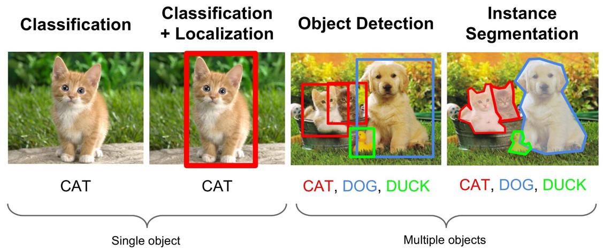

    -   If you want to classify an image into a certain category, it could happen that the object or the characteristics that are required to perform categorisation are `too small` with respect to the `full image`.

## 1.1 General Object Detection Framework

-   Three steps in an object detection framework : - Generate `regions of interest` or `region proposals`. - Produce `visual feature extraction` and evaluate which objects are present for each visual features. - Overlapping boxes are combined into a single bounding box (`non-maximum suppression`)
    

### 1.1.1 Region proposals

-   Brute-force approaches - These brute-force approaches are similar to a `sliding window` that is applied to the image, over several ratios and scales. <br>
    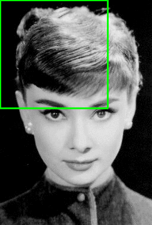 - classifier use all region produced by sliding window,
    
-   Selective Search - A `clustering based approach` which attempts to group pixels and generate proposals based on the generated clusters. - Grouped pixel based on linear combination of `Color`, `Texture`, `Size` and `Shape` Similarity.
     - Selective Search segmenting & merging at multiple scale,
    

### 1.1.2 Feature Extraction

-   Feature extraction is to reduce a variable sized image to a fixed set of visual features.
-   In object detection frameworks, people typically use `pretrained image classification` models to `extract visual features`, as these tend to generalise fairly well.
-   This part also known as `Backbone Network`.
    

### 1.1.3 Non-maximum Suppression

-   Idea of non-maximum suppression is to `reduce` the number of `detections` in a frame to the actual number of objects present.
    
-   https://towardsdatascience.com/non-maximum-suppression-nms-93ce178e177c

## 1.2 Evaluation metric

-   The most common evaluation metric is **mAP** (`mean average precision`) in Object detection (localisation and classification).
-   mAP is the average of **AP** (`average precision`).
-   Average Precision (AP) is finding the area `under` the `precision-recall` curve.
-   How to calculate mAP ?
    -   For each bounding box, measure an `overlap` between the `predicted` bounding box and the `ground truth` bounding box.
    -   This is measured by **IoU** (`intersection over union`).
        
    -   Find True Positive (TF) and False Positive (FP) by applying some threshold (usually `0.5`).
    -   For example,
        -   if IoU value for a prediction is `0.7`, then we classify it as `True Positive (TF)`.
        -   On the other hand, if IoU is `0.3`, we classify it as `False Positive (FP)`.
            
    -   calculate Precision & Recall for each class
        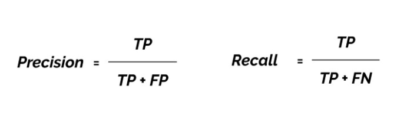
    -   plot precision & recall and calculate area under precision-recall curve for each class,
        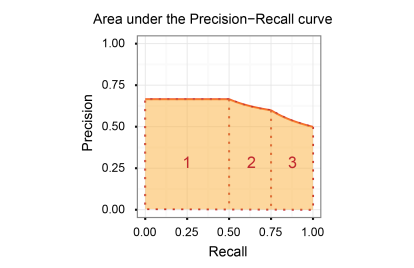 - Example, the areas of the three trapezoids 1, 2, 3 are 0.335, 0.15875, and 0.1375. Total is 0.63125.
    -   calculate mAP by averaging all AP result for each class.

---

# 2. Basic concept R-CNN, Fast R-CNN & Faster R-CNN

## 2.1 Region-based CNN (R-CNN)

-   R-CNN which was introduced in `November 2013` by `Ross Girshick` et al.
-   **Regions** : ~2000 Selective Search proposals
-   **Feature Extractor** : `AlexNet` pre-trained on `ImageNet`, fine-tunned PASCAL 2007 <br>
    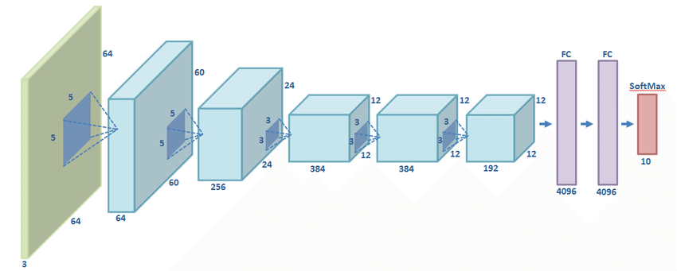
-   Use `Bounding box regression` to refine box location,
    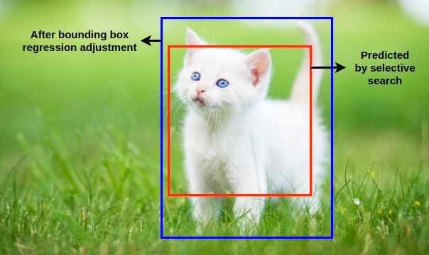
-   `Performance`: mAP of 53.7% on PASCAL 2007 <br>
    
-   Pros : - Accurate - Any architecture can be used as a feature
    extractor (VGG, AlexNet, DenseNet, etc.)
-   Cons : - `Hard to train` (lots of training objectives:
    softmax classi̎ier, linear SVMs, bound-box
    regressions, lot of them train separately) - `Slow training` (`84h` on GPU) - `Inference` (detection) `is slow` (47s / image with VGG-16 feature extractor)

## 2.2 Fast R-CNN

-   R-CNN is slow because it performs a ConvNet forward
    pass for each object proposal, without sharing computation.
-   Fast R-CNN method computes a `convolutional feature map` for the `entire input image` and then classifies each object proposal using a feature vector extracted from the shared feature map.
-   Fast R-CNN was introduced in `April 2015` by `Ross Girshick` et al.
-   Trains R-CNN with `VGG16` network is `8.8x` faster than R-CNN.
-   `146x` faster at test-time (~ 0.32s).
-   Achieves a higher mAP on PASCAL VOC 2007 with a mAP of `66.9%`.
    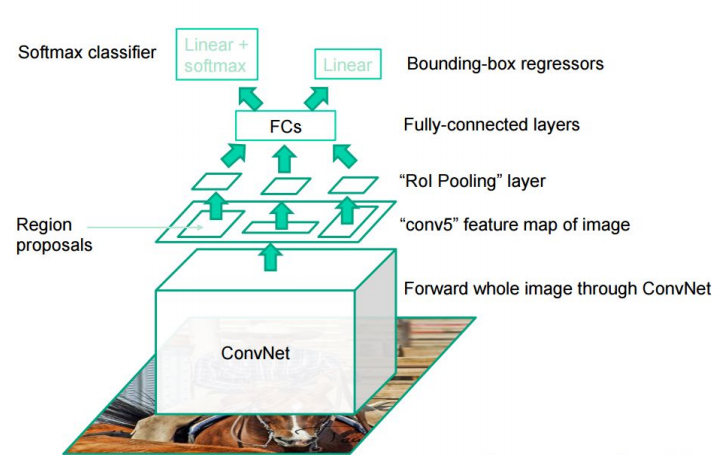

## 2.3 Faster R-CNN

-   Region proposal computation is a `bottleneck` in Fast R-CNN.
-   Faster R-CNN using `Region Proposal Network (RPN)` as region proposal which shares full-image `convolutional features` with the `detection network`.
-   Faster R-CNN is composed of two modules. The first module is a `Region Proposal Network (RPN)` and the second module is the `Fast R-CNN` detector.
-   `250x` faster at test-time (~ 0.2s).
-   Achieves a higher mAP on PASCAL VOC 2007 with a mAP of `69.9%`.
    

---

# 3. Faster R-CNN Inferencing

## 3.1 Install Latest OpenCV with CUDA Enable

-   Install Jetson status

    ```
    sudo apt-get install python-pip
    sudo -H pip install -U jetson-stats
    reboot
    ```

-   Check nvidia status

    ```
    jtop
    ```

    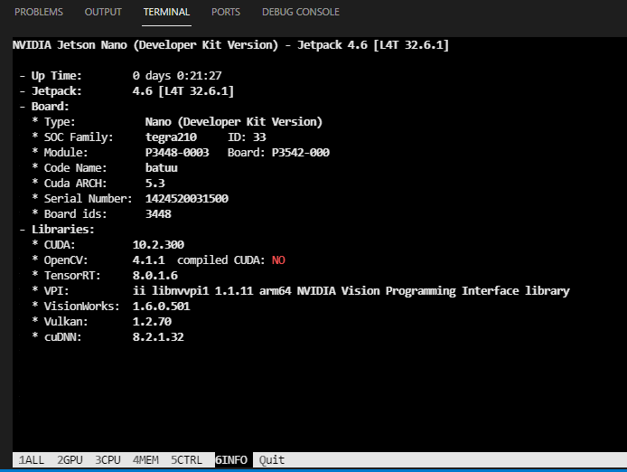

-   Enlarge memory swap to install OpenCV.

    ```
    # install nano
    sudo apt-get install nano

    # install dphys-swapfile
    sudo apt-get install dphys-swapfile

    # enlarge the boundary
    sudo nano /sbin/dphys-swapfile

    ```
-   Change Max Swap
    ```
    CONF_SWAPSIZE=4096
    CONF_MAXSWAP=6074
    ```

    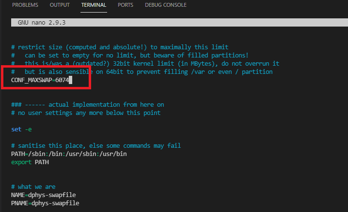

    ```
    # reboot afterwards
    sudo reboot
    ```

-   Run the installation script
    ```
    wget https://github.com/Qengineering/Install-OpenCV-Jetson-Nano/raw/main/OpenCV-4-5-0.sh
    sudo chmod 755 ./OpenCV-4-5-0.sh
    ./OpenCV-4-5-0.sh
    ```
-   Run `jtop` to check cuda enabled :

    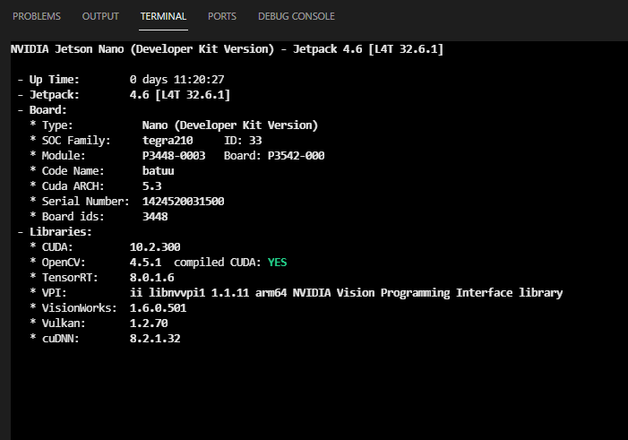

## 3.3 Check OpenCV Info

-   createfile `opencv_info.py` and write following code :
    ```
    import cv2
    print(cv2.getBuildInformation())
    ```
-   Run `opencv_info.py` script, result from that script :

    ```
    General configuration for OpenCV 4.5.1 =====================================
    Version control:               unknown

    Extra modules:
        Location (extra):            /home/jetson/opencv_contrib/modules
        Version control (extra):     unknown

    Platform:
        Timestamp:                   2021-12-16T18:46:46Z
        Host:                        Linux 4.9.253-tegra aarch64
        CMake:                       3.10.2
        CMake generator:             Unix Makefiles
        CMake build tool:            /usr/bin/make
        Configuration:               RELEASE

        ....
    ```

## 3.3 Test CUDA in Jetson Nano

-   Create file `cuda_test.py` :

    ```
    import cv2
    import numpy as np

    print("[CUDA TEST] Check CUDA enable device")
    count = cv2.cuda.getCudaEnabledDeviceCount()
    print("CUDA enable device count : %s \n" % count)

    print("[CUDA TEST] test CUDA upload & download")
    npMat = (np.random.random((128, 128, 3)) * 255).astype(np.uint8)
    cuMat = cv2.cuda_GpuMat()
    cuMat.upload(npMat)
    print( "Uploaded & Downloaded Matrix is close : %s \n" % np.allclose(cuMat.download(), npMat))

    print("[CUDA TEST] test CUDA interoperability")
    npMat = (np.random.random((128, 128, 3)) * 255).astype(np.uint8)

    cuMat = cv2.cuda_GpuMat()
    cuMat.upload(npMat)
    print("Upload pointer:", cuMat.cudaPtr())

    stream = cv2.cuda_Stream()
    print("CUDA stream pointer:", stream.cudaPtr())
    ```

-   Run `cuda_test.py` script, result from that script :

    ```
    [CUDA TEST] Check CUDA enable device
    CUDA enable device count : 1

    [CUDA TEST] test CUDA upload & download
    Uploaded & Downloaded Matrix is close : True

    [CUDA TEST] test CUDA interoperability
    Upload pointer: 64433225728
    CUDA stream pointer: 181490592
    ```

---

## 3.5 Tensorflow Faster R-CNN model Inferencing Using OpenCV DNN

-   To use OpenCV DNN with Backend CUDA for Inferencing Tensorflow model, we need to prepare `frozen optimized for inference graph` in bynary (.pb) and text format (.pbtxt)
    ```
    cv2.dnn.readNetFromTensorflow('model.pb', 'model.pbtxt')
    ```
-   For now, we just use pre-trained `faster R-CNN` models with backbone `ResNet-50` on `COCO` dataset.
    -   Weight : [[faster_rcnn_resnet50_coco_2018_01_28.tar.gz](http://download.tensorflow.org/models/object_detection/faster_rcnn_resnet50_coco_2018_01_28.tar.gz)]
    -   Config : [[faster_rcnn_resnet50_coco_2018_01_28.pbtxt](https://raw.githubusercontent.com/opencv/opencv_extra/master/testdata/dnn/faster_rcnn_resnet50_coco_2018_01_28.pbtxt)]
-   Extract `faster_rcnn_resnet50_coco_2018_01_28.tar.gz` and copy `frozen_inference_graph.pb` to `model/` directory in this tutorial (inside jetson nano) <br>
    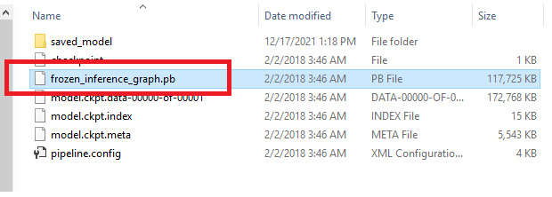
-   Next, copy `faster_rcnn_resnet50_coco_2018_01_28.pbtxt` to `model/` directory as before.
-   Open `faster_r-cnn.py` in this tutorial using VS Code (inside jetson nano).

---

# Tensor RT


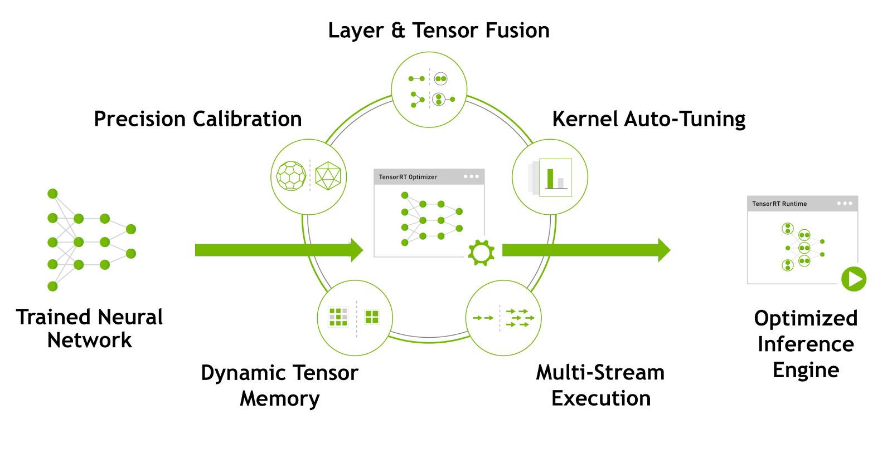 

Deep Learning has a wide range of applications such as Self Driving cars, Aerial Surveillance, Real Time Face Recognition solutions, Real Time Language Processing solutions to name a few. But there is only one similarity among these applications. REAL TIME. Considering the need for real time performance (throughput) of these models, we need to optimize the trained model so that it is lite but provides close to training accuracy.

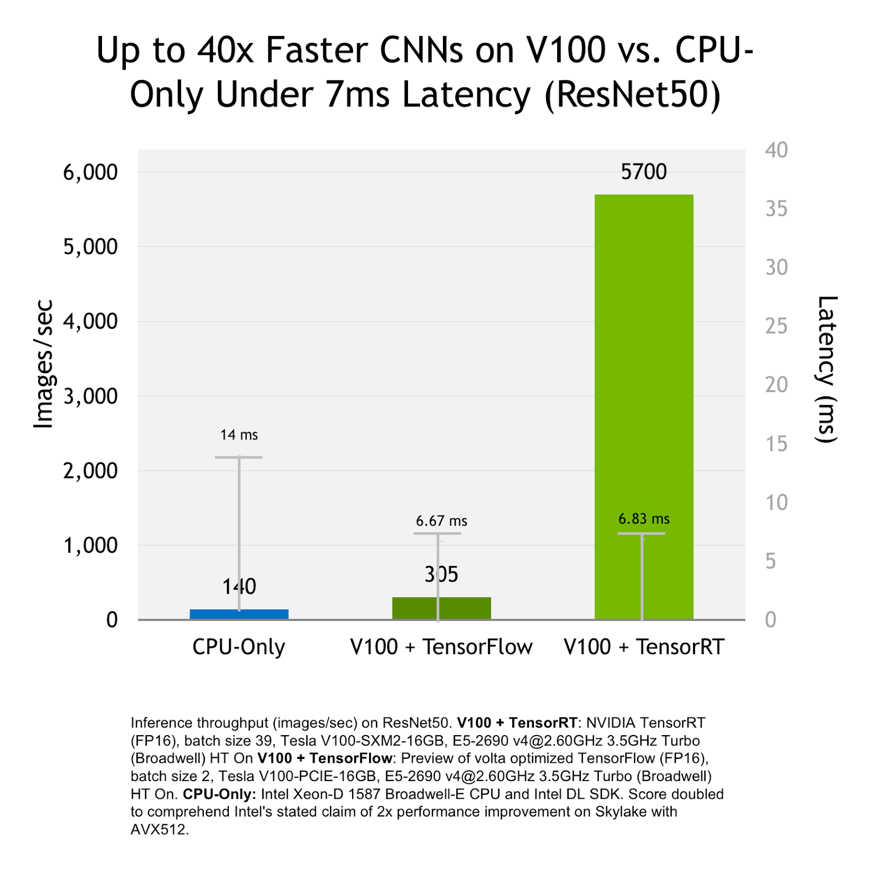

TensorRT is a Deep Learning Inference platform from NVIDIA. It is built on NVIDIA CUDA programming model which helps us leverage the massive parallel performance offered by NVIDIA GPUs. Deep Learning models from almost all popular frameworks can be parsed and optimized for low latency and high throughput inference on NVIDIA GPUs using TensorRT.

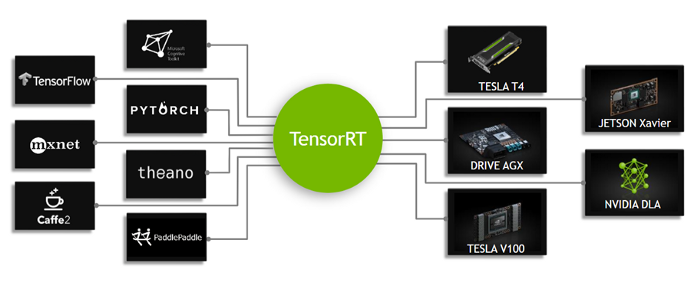
    
With TensorRT, we can do various optimizations effortlessly. The following are few important optimizations that can be done using TensorRT.
-   Mixed Precision Inference
-   Layer Fusion
-   Batching
-   Kernel Auto Tunning
-   Dynamic Tensor Memory

---

- Mixed Precision Inference
    Single Precision Floating Point or FP32 in short is the choice of precision when it comes to Deep Learning training.

    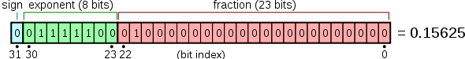


    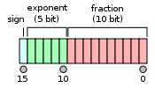

    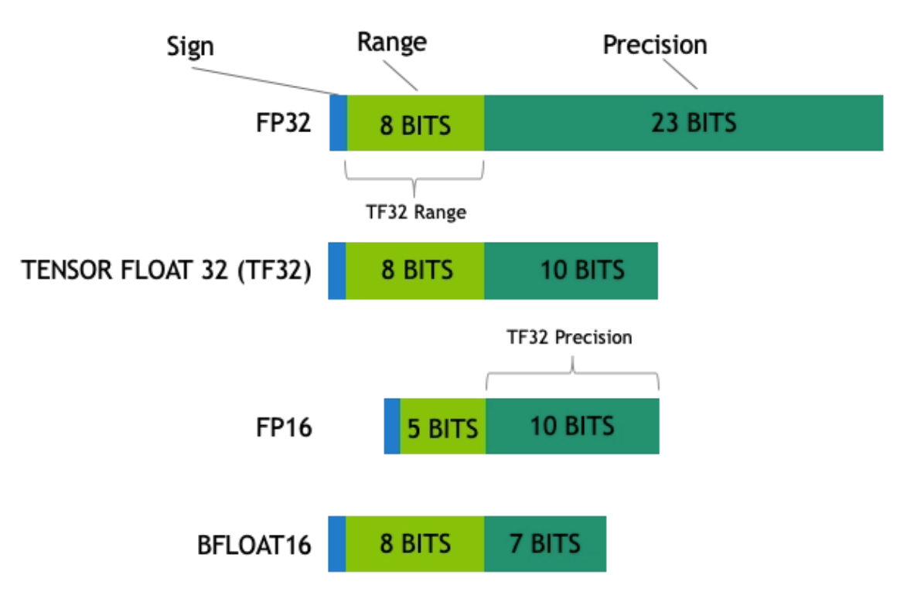

    FP32 has 8 bits to represent the exponent and 23 bits to represent the fraction which is ideal for all those gradient calculations and updates. During inference if the model gives close to training accuracy and if it is half as heavy as it is during training then we have the advantage of less memory utilization and high throughput. With TensorRT, we can create a production model that is in FP16 precision or INT 8 or INT 4 precision.

    


-  Layer Fusion

    Before talking about layer fusion let us look at how an instruction is processed. To process an instruction, operands in the memory has to be transferred to the registers, the operation is then carried out by the processor and the results are again copied back to the memory. With this rough idea let us look at layer fusion.

    

    Layers in most of the Deep Learning models follow a sequence. For example, a Convolution layer is followed by a Batch Normalization layer followed by an Activation layer. Here we have three operations to be performed sequentially. Instead of transferring the data back and forth between memory and registers for each operation, through Layer fusion we transfer data once from memory to registers, perform all the three operations sequentially and transfer back the final result to the memory. By doing this we save four costly data transfer cycles.

    

    As shown above, TensorRT recognizes all layers with similar input and filter size but with different weights and combines them to form a single 1x1 CBR layer as shown in the right side.

- Batching
    GPUs have thousands of processing cores; it is only that we need to use them efficiently. By planning proper batch size of our input data based on the target platform of deployment, we can optimally leverage the huge number of available cores.

- Kernel auto-tuning

    While optimizing models, there is some kernel specific optimization which can be performed during the process. This selects the best layers, algorithms, and optimal batch size based on the target GPU platform. For example, there are multiple ways of performing convolution operation but which one is the most optimal way on this selected platform, TRT opts that automatically.

- Dynamic Tensor Memory
    TensorRT improves the memory reuse by allocating memory to tensor only for the duration of its usage. It helps in reducing the memory footprints and avoiding allocation overhead for fast and efficient execution.

- Multiple Stream Execution
    TensorRT is designed to process multiple input streams in parallel. This is basically Nvidia’s CUDA stream.


## Using Tensorflow-TensorRT (TF-TRT) API
Now we have seen the process, how TRT optimizes the model for faster inference and lower latency. Next, we will look into Tensorflow-TRT API for optimizing our deep learning models for faster inference.

Setting up environment for TensorRT:

To setup TensorRT on your system execute the below commands in terminal to setup TensorRT on 64 bit Ubuntu 18.04 and TensorFlow≥2.0
We need to install NVIDIA machine learning package, libnvinfer5 and TensorFlow-GPU only if we want to use NVIDIA GPU while optimization.

```
pip install tensorflow-gpu==2.0.0

wget https://developer.download.nvidia.com/compute/machine-learning/repos/ubuntu1804/x86_64/nvidia-machine-learning-repo-ubuntu1804_1.0.0-1_amd64.deb
  
dpkg -i nvidia-machine-learning-repo-*.deb
apt-get update

sudo apt-get install libnvinfer5
```

First of all we import trt_converter and a per-trained resnet50 model, on which the optimization needs to be performed. If we want our model to get optimized in FP16 or Fp32 precision then we can just change precision_mode parameter in conversion parameters. Also, we can setup max_workspace_size_bytes parameter which indicates your maximum RAM capacity on your system.

```
from tensorflow.python.compiler.tensorrt import trt_convert as trt
from tensorflow.keras.applications.resnet50 import ResNet50

model = ResNet50(weights='imagenet')


print('Converting to TF-TRT FP32...')
conversion_params = trt.DEFAULT_TRT_CONVERSION_PARAMS._replace(precision_mode=trt.TrtPrecisionMode.FP32,
                                                               max_workspace_size_bytes=8000000000)

converter = trt.TrtGraphConverterV2(input_saved_model_dir='resnet50_saved_model',
                                    conversion_params=conversion_params)
converter.convert()
converter.save(output_saved_model_dir='resnet50_saved_model_TFTRT_FP32')
print('Done Converting to TF-TRT FP32')
```

But, while converting precision to INT8 we also need calibration data as described previously in this post and we can pass this calibration input data while calling the convert function. The code snippet is shown below.

```
batch_size = 8
batched_input = np.zeros((batch_size, 224, 224, 3), dtype=np.float32)

for i in range(batch_size):
  img_path = './data/img%d.JPG' % (i % 4)
  img = image.load_img(img_path, target_size=(224, 224))
  x = image.img_to_array(img)
  x = np.expand_dims(x, axis=0)
  x = preprocess_input(x)
  batched_input[i, :] = x
batched_input = tf.constant(batched_input)
print('batched_input shape: ', batched_input.shape)

print('Converting to TF-TRT INT8...')
conversion_params = trt.DEFAULT_TRT_CONVERSION_PARAMS._replace(
    precision_mode=trt.TrtPrecisionMode.INT8, 
    max_workspace_size_bytes=8000000000, 
    use_calibration=True)
converter = trt.TrtGraphConverterV2(
    input_saved_model_dir='resnet50_saved_model', 
    conversion_params=conversion_params)

def calibration_input_fn():
    yield (batched_input, )
converter.convert(calibration_input_fn=calibration_input_fn)

converter.save(output_saved_model_dir='resnet50_saved_model_TFTRT_INT8')
print('Done Converting to TF-TRT INT8')
```

## TIPS!

### 1. Free up memory by disabling GUI

-   To disable GUI on boot, run:

    ```
    sudo systemctl set-default multi-user.target
    ```

-   To enable GUI again, run:
    ```
    sudo systemctl set-default graphical.target
    ```

# Source

- https://developer.nvidia.com/embedded/jetson-nano-dl-inference-benchmarks
- https://developer.nvidia.com/blog/tensorrt-3-faster-tensorflow-inference/
-   https://qengineering.eu/install-opencv-4.5-on-jetson-nano.html
-   https://www.datacamp.com/community/tutorials/object-detection-guide
-   https://www.pyimagesearch.com/2020/06/29/opencv-selective-search-for-object-detection/
-   https://arxiv.org/abs/1504.08083
-   https://arxiv.org/pdf/1506.01497.pdf
-   https://towardsdatascience.com/map-mean-average-precision-might-confuse-you-5956f1bfa9e2#:~:text=mAP%20(mean%20average%20precision)%20is,difference%20between%20AP%20and%20mAP.
-   https://classeval.wordpress.com/introduction/introduction-to-the-precision-recall-plot/
-   https://jeanvitor.com/tensorflow-object-detecion-opencv/
-   https://github.com/opencv/opencv/wiki/TensorFlow-Object-Detection-API
